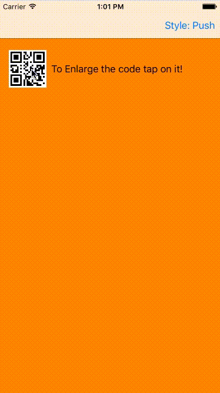

<p align="center">

<a href="https://developer.apple.com/swift"></a>
<a href="https://cocoapods.org"></a>
<a href="http://mit-license.org"></a>

</p>

# TransEasy
An easy to implement custom transitions.
<div align="center">

</div>
## Overview:

This library will help easily customize your transitions (Modal and Push) so that you can be able to move your views from one to another.

---
## How to setup:

### Cocoapods (Recommended)

1-  In your pod file add:
```
pod 'TransEasy'
```
2-  In terminal:
```
$ pod update
```

### Manual

Clone or download this repo, add files inside `Source` folder to your project.

---

## How to use:

### Real easy approach:

In this method you will setup the EasyTrans very easily using a simple method and us it for both push transitions and modal presentations.

```swift
 func next() {

    guard let destinationViewController = storyboard?.instantiateViewControllerWithIdentifier("secondVC") else {
      return
    }
    // This method adds easy trans to the SecondViewController using the provided options for present and dismiss.

    setupEasyTransition(on: destinationViewController, presentOptions: TransEasyPresentOptions(duration: 0.4, sourceView: qrButton, blurStyle: UIBlurEffectStyle.Dark), dismissOptions: TransEasyDismissOptions(duration: 0.4, destinationView: qrButton, interactive: true))

    if modal {
      presentViewController(destinationViewController, animated: true, completion: nil)
    } else {
      performSegueWithIdentifier(toSecondViewSegueID, sender: sender)
    }

  }

```

In the destination view controller:

```swift
extension SecondViewController: TransEasyDestinationViewControllerProtocol {

  func transEasyDestinationView() -> UIView {
    return qrImage
  }

}

```

And to be able to use TransEasy for pop transitions in source view controller:

```swift

func transEasyDestinationView() -> UIView {
    return qrButton
  }

```


### Not so easy approach (Modal Presentation Only):
Alternatively, you can implement the `transitioningDelegate` yourself and just use the animator controller.
 * In your view controller add required properties to hold animators:

```swift

    let presentAnimator: EasyPresentAnimationController = EasyPresentAnimationController()
    let dismissAnimator: EasyDismissAnimationController = EasyDismissAnimationController()    
```

* In `prepareForSegue`, set the `transitioningDelegate`:

```swift

segue.destinationViewController.transitioningDelegate = self


```

* Extend your view controller to use the **TransEasy** transitions:


 ```swift


 extension ViewController: UIViewControllerTransitioningDelegate {

     func animationControllerForPresentedController(presented: UIViewController, presentingController presenting: UIViewController, sourceController source: UIViewController) -> UIViewControllerAnimatedTransitioning? {

         guard let secondVC = presented as? SecondViewController else {
             return nil
         }

         presentAnimator.duration = 0.4
         presentAnimator.originalView = qrButton
         presentAnimator.destinationView = secondVC.qrImage
         presentAnimator.blurEffectStyle = .Dark


         return presentAnimator
     }

     func animationControllerForDismissedController(dismissed: UIViewController) -> UIViewControllerAnimatedTransitioning? {

         guard let secondVC = dismissed as? SecondViewController else {
             return nil
         }
         dismissAnimator.duration = 0.4
         dismissAnimator.originalView = secondVC.qrImage
         dismissAnimator.destinationView = qrButton

         return dismissAnimator
     }

 }

 ```

---

## TODO:

- [x] Setup basic Structure for project.
- [x] Create demo views and make the relations.
- [x] Create Required Classes and Protocols
- [x] Add License file.
- [x] Add Documentations.
- [x] Add screenshots.
- [ ] Add CI.
- [x] Add Pod support.
- [ ] Make Transitions Interactive.
- [ ] Match Pop Animation to the original animation.
- [ ] Add Present transitioning options for Modal presentations.
- [ ] Add Delegate object and events for transitions.
